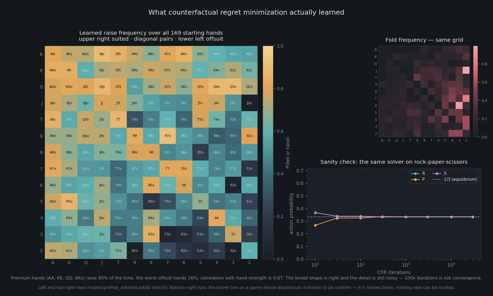

# Poker AI

**[Play the live demo](https://adxezq5hym7s2n7mururqg.streamlit.app/)** — play against the AI or try the hand calculator.

Texas Hold'em AI using Counterfactual Regret Minimization (CFR) to compute
Nash equilibrium strategies, plus a playable Streamlit table and a YOLO vision
layer that reads cards and chips off a photo of a real table.



*Generated by `docs/render_figure.py`, which reads the trained strategy in
`models/preflop_infoSets.joblib` and runs the solver live on rock-paper-scissors.*

## What CFR is doing here

Poker is an imperfect-information game: you cannot see your opponent's cards,
so there is no "best move" in the minimax sense — only a best *distribution*
over moves. The solution concept is a Nash equilibrium, a strategy that cannot
be exploited no matter what the opponent does.

Counterfactual Regret Minimization finds one by self-play. It repeatedly walks
the game tree and, at each decision point, accumulates *regret* for every
action: how much better off it would have been having always played that action
instead of what it actually did. The next iteration's strategy is proportional
to the positive regret. Averaged over many iterations, this provably converges
to equilibrium.

The practical obstacle is that Hold'em has ~10^160 decision points, far too
many to store. So decision points are grouped into **information set
abstractions** — hands that should be played the same way share a bucket
(`src/ai/abstraction.py`), keyed on equity rather than exact cards. The trained
output is a mapping from abstracted information set to action distribution,
stored as a `.joblib` file.

`examples/rps.py` runs the same algorithm on rock-paper-scissors, where the
equilibrium is known to be uniform — a sanity check that the CFR
implementation itself is correct before trusting it on a game whose answer
nobody knows.

## What it actually learned

Reading the trained preflop strategy back out gives the chart above. Premium
hands (AA, KK, QQ, AKs) raise about 80% of the time and the worst offsuit
hands about 16%, and aggression correlates with hand strength at 0.67.

So it found the broad shape without ever being told the rules of thumb — no
starting-hand chart, no equity table, nothing but self-play. It is also
visibly noisy: neighbouring cells that should be nearly identical are not,
because 100,000 iterations is enough for the gradient and not enough for
convergence. The honest reading is that the algorithm is right and the compute
budget is small.

The rock-paper-scissors panel is why that claim can be made at all. RPS has a
known equilibrium — uniform thirds — so running the same solver on it converts
"the poker output looks plausible" into "the solver provably hits equilibrium
on a game where equilibrium is known." It gets there within a few hundred
iterations.

## Play against it

```bash
streamlit run app.py
```

A heads-up Texas Hold'em demo with hole cards, a board, betting controls,
action log, and stack history. Switch to **Hand calculator** to select cards
and run a Monte Carlo estimate against a random opponent. Each browser session
has its own game; chips have no monetary value.

The engine uses simplified betting rules. Probability readouts count ties as
wins, so they show **win or tie probability**, not split-pot equity. Empty
stacks refill on the next hand; **Reset session** starts fresh.

### Publish the demo

Streamlit Community Cloud hosts Python apps at a public `*.streamlit.app` URL.
GitHub hosts this source code; GitHub Pages cannot run the Python app.

1. Sign in to [Streamlit Community Cloud](https://share.streamlit.io/) with GitHub.
2. Choose **Create app**, then select `lucascarsonbrown/Poker`, branch `main`,
   and entrypoint `app.py`.
3. In advanced settings, choose Python **3.11**. Optionally request an available
   subdomain such as `lucas-poker-ai`, then deploy. No app secrets are needed.
4. Open the assigned URL and try both modes. Copy that actual URL into a
   `Play the live demo` link near the top of this README and the repository's
   **About → Website** field.

The hosting service installs `requirements.txt` and reads `.streamlit/config.toml`.
Both strategy models are tracked in this repo. Future pushes to the deployed
branch update the app. See the [official deployment guide](https://docs.streamlit.io/deploy/streamlit-community-cloud/deploy-your-app/deploy).

The current demo is hosted on [Streamlit Community Cloud](https://adxezq5hym7s2n7mururqg.streamlit.app/).

## Installation

```bash
pip install -r requirements.txt
```

## Quick Start

### Calculate hand equity

```python
from src.calculator import PokerCalculator

calc = PokerCalculator("models/")

equity = calc.get_equity(
    hole_cards=["Ah", "Kd"],
    community_cards=["Qh", "Jd", "Ts"]
)
print(f"Win probability: {equity:.1%}")
```

### Get an AI action recommendation

```python
result = calc.get_ai_action(
    hole_cards=["Ah", "Kd"],
    community_cards=["Qh", "Jd", "Ts"],
    pot_size=100,
    to_call=20
)
print(f"Recommended: {result['action']}")
print(f"Hand equity: {result['equity']:.1%}")
```

### Run a full game loop

```python
from src.environment import PokerEnvironment

env = PokerEnvironment()
env.add_player()
env.add_ai_player()
env.start_new_round()

while not env.end_of_round():
    state = env.get_game_state()
    if state['player_in_play'] == 0:
        action = input("Action (f/k/c/bX): ")
        env.handle_game_stage(action)
    else:
        env.handle_game_stage()  # AI plays automatically

print(f"Winner: Player {env.get_winner_indices()[0]}")
```

## Training

The AI requires pre-trained strategy models. Without them, `PokerCalculator` falls back to equity-based heuristics.

```bash
# Preflop strategy (~5-10 min)
python -m training.preflop_trainer -i 100000 -b 5 -o models/preflop_infoSets.joblib

# Postflop strategy (~30-60 min, slower due to equity calculations)
python -m training.postflop_trainer -i 50000 -b 3 -s 10000 -o models/postflop_infoSets.joblib
```

See [training/README.md](training/README.md) for all options and how training works.

## Project Structure

```text
Poker/
├── app.py        # Streamlit table — play against the AI
├── src/          # Runtime library (calculator, environment, evaluator, AI)
├── training/     # CFR training scripts and the base algorithm
├── cv/           # YOLO card and chip detection
├── examples/     # Standalone demos (RPS as a CFR sanity check)
└── models/       # Trained strategy files (.joblib)
```

## Computer vision

`cv/` trains YOLOv8 detectors to read a physical table: one model for playing
cards, one for chip stacks. `cv/train_cards.py` and `cv/train.py` handle
training, `cv/detect.py` runs inference on an image, and `cv/server.py` exposes
detection over HTTP so the game loop can consume a real table state instead of
typed input.

Training data and trained weights are not committed — the datasets run to
several GB and the weights to a few hundred MB. The training scripts point at
standard YOLOv8-format datasets and will fetch or expect them locally.

## Card Format

Two-character strings: rank + suit.

| Type  | Values                        |
|-------|-------------------------------|
| Ranks | `A` `2`-`9` `T` `J` `Q` `K` |
| Suits | `h` `d` `c` `s`              |

Examples: `"Ah"` (Ace of hearts), `"Td"` (Ten of diamonds)

## Action Format

| Action | Meaning                         |
|--------|---------------------------------|
| `f`    | Fold                            |
| `k`    | Check                           |
| `c`    | Call                            |
| `bX`   | Bet/raise X chips (e.g. `b100`) |

---

MIT License
